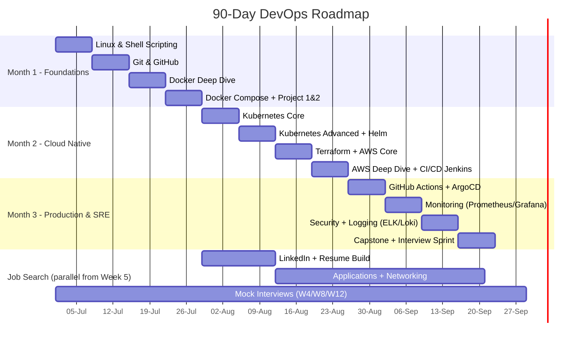
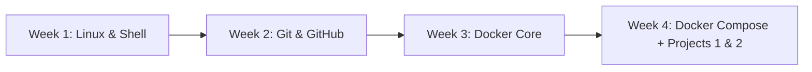

# 🚀 The 90-Day DevOps / Cloud / SRE Engineer Roadmap
### From Zero to Job-Ready — A Mentor-Guided, Project-Based Program (2026 Edition)

> Built like a real onboarding plan at a top-tier tech company: daily structure, weekly milestones, production-grade projects, and a job-search engine running in parallel with your learning.

---

## How to Use This Document

This is one continuous program split across 4 files (all delivered together):

| File | Contents |
|---|---|
| `00-roadmap-part1.md` | Program overview, daily schedule, Month 1 (Linux, Git, Docker) |
| `00-roadmap-part2.md` | Month 2 (Kubernetes, Terraform, AWS, CI/CD) |
| `00-roadmap-part3.md` | Month 3 (Monitoring, Security, SRE, Capstone) + all 10 Projects in full detail |
| `00-roadmap-part4.md` | GitHub portfolio, Resume, LinkedIn, Interview Q&A banks, Mock interviews, Certifications, Resources, Trackers, 30-day job plan |

Print or copy the trackers into a spreadsheet/Notion board. Update them daily — consistency compounds more than raw hours.

---

## 🎯 Non-Negotiable Ground Rules

1. **Build in public.** Every project goes on GitHub with a real README, from Day 1.
2. **Type every command yourself.** No copy-pasting into a terminal — muscle memory is the goal.
3. **Break things on purpose.** The fastest way to learn troubleshooting is to intentionally misconfigure something and fix it.
4. **Document as you go.** Keep a `learning-log.md` — write 3-5 lines every night: what you learned, what broke, what you'd do differently.
5. **One weak topic ≠ restart.** If Week 3 topics resurface in Week 9, that's expected. Spaced repetition is built into this plan.
6. **Job search starts Day 1, not Day 90.** LinkedIn, networking, and light applications run in parallel from Month 2 onward.

---

## 🗓️ 90-Day Master Timeline (Mermaid Gantt)



---

## ⏰ Daily Schedule Template (5–6 hrs/day)

Use this every single day. Adjust start time to your life, not the other way around.

| Block | Time (suggested) | Duration | Focus |
|---|---|---|---|
| **Morning — Theory** | 7:00–8:30 AM | 1.5 hr | Read docs/watch videos on today's topic, take notes in your own words |
| **Afternoon — Hands-on** | 1:00–3:30 PM | 2.5 hr | Labs, terminal practice, run every command from the day's list |
| **Evening — Project** | 7:00–8:30 PM | 1.5 hr | Apply the day's topic to your mini/major project, commit to GitHub |
| **Night — Revision** | 9:00–9:30 PM | 0.5 hr | Flashcards/quiz yourself, update `learning-log.md`, plan tomorrow |

**Daily Checklist (copy into your tracker every day):**

- [ ] Watched/read theory for today's topic
- [ ] Completed hands-on lab
- [ ] Practiced today's command list from memory (no notes)
- [ ] Made a commit to GitHub with a meaningful message
- [ ] Updated learning log (3–5 lines)
- [ ] Reviewed yesterday's notes for 10 min (spaced repetition)

**Weekend Structure (Sat/Sun):**
- **Saturday:** Catch-up + deep-dive lab + mini-project completion
- **Sunday AM:** Weekly assessment (quiz + hands-on challenge, see each week)
- **Sunday PM:** Resume/LinkedIn/portfolio work (from Week 5 onward) + rest

---

# 📅 MONTH 1 — Linux, Git, Docker Foundations

**Month 1 Goal:** Be able to administer a Linux server confidently, use Git/GitHub like a professional engineer, and containerize any application with Docker.



## Week 1 — Linux Fundamentals & Shell Scripting

**Learning Topics:** Linux filesystem hierarchy, Ubuntu basics, users/groups/permissions (chmod/chown/umask), process management (ps/top/htop/kill/nice), package management (apt), systemd services, cron jobs, SSH & key-based auth, log management (/var/log, journalctl), text processing (grep/sed/awk), shell scripting (variables, loops, conditionals, functions, exit codes), environment variables, networking basics (ip, netstat/ss, curl, ping, traceroute).

**Hands-on Labs:**
- Spin up an Ubuntu EC2 instance (or VirtualBox/WSL2) and SSH into it with a key pair
- Create 3 users, 2 groups; configure sudo access for one user only
- Set up a cron job that rotates logs every night at 2 AM
- Write a bash script that monitors disk usage and emails/alerts if >80%
- Configure passwordless SSH between two machines

**Mini Project — "Linux Server Health Check Automation":**
A bash script (`healthcheck.sh`) that reports CPU, memory, disk, top processes, failed login attempts, and open ports, and can run via cron, output to a log file, and optionally push to Slack via webhook.

**Commands to Practice:**
```bash
# Users & permissions
useradd -m -s /bin/bash devops_user && passwd devops_user
usermod -aG sudo devops_user
chmod 750 script.sh && chown devops_user:devops_group script.sh
umask 022

# Process management
ps aux --sort=-%mem | head -10
top -o %CPU
kill -9 <PID>
nice -n 10 ./long_script.sh
systemctl status nginx && systemctl enable --now nginx

# Networking
ip a
ss -tulnp
curl -I https://example.com
traceroute google.com
scp file.txt user@host:/path/

# Cron
crontab -e
# 0 2 * * * /home/user/scripts/logrotate.sh >> /var/log/logrotate.log 2>&1

# Logs
journalctl -u nginx -f
tail -f /var/log/syslog
grep -i "error" /var/log/syslog | awk '{print $1,$2,$3}'

# SSH
ssh-keygen -t ed25519 -C "devops@example.com"
ssh-copy-id user@remote-host
```

**Daily Tasks (Mon–Fri example):**
| Day | Focus |
|---|---|
| Mon | Filesystem hierarchy, basic commands, package management |
| Tue | Users, groups, permissions, sudo |
| Wed | Process management, systemd, services |
| Thu | Cron, SSH, log management |
| Fri | Shell scripting (variables, loops, functions) → build healthcheck.sh |

**Reading Material:**
- *The Linux Command Line* by William Shotts (free PDF) — Ch. 1–15
- Ubuntu Server Guide (official docs)
- `man` pages for every command you run — build the habit now

**Videos:**
- freeCodeCamp — "Linux Crash Course for Beginners"
- NetworkChuck — "Linux for Hackers" series (great for practical mental models)
- KodeKloud — Linux Basics course

**Documentation:**
- https://ubuntu.com/server/docs
- https://www.gnu.org/software/bash/manual/

**Expected Outcome:** You can SSH into any Linux box, diagnose a resource issue, manage users/permissions safely, write a working bash script from scratch, and explain systemd/cron confidently.

---

## Week 2 — Git, GitHub & Collaboration Workflows

**Learning Topics:** Git internals (working dir/staging/repo), init/clone/add/commit/push/pull, branching strategies (Git Flow, trunk-based, GitHub Flow), merge vs rebase, resolving conflicts, `.gitignore`, tags/releases, pull requests & code review etiquette, GitHub Actions basics (as a preview — deep dive in Month 3), forking workflow, GitHub CLI, git hooks.

**Hands-on Labs:**
- Create a repo, make 10 commits with proper conventional-commit messages
- Practice a merge conflict on purpose — create it on two branches editing the same line, then resolve it
- Do an interactive rebase to squash 5 commits into 2
- Set up a branch protection rule requiring PR review before merge
- Open a PR against your own repo, review it, request changes, then merge with squash

**Mini Project — "Git Workflow Simulation":**
Simulate a 3-person team workflow solo: create `feature/`, `bugfix/`, `release/` branches, cut a release with a git tag, write a CHANGELOG.md, and document your branching strategy in the README.

**Commands to Practice:**
```bash
git init && git remote add origin <url>
git checkout -b feature/login-page
git add . && git commit -m "feat: add login page skeleton"
git push -u origin feature/login-page

# Rebase & history
git rebase -i HEAD~5
git rebase main
git log --oneline --graph --all

# Merge conflict resolution
git merge feature/login-page
git status
git diff
git add <resolved-file> && git commit

# Undo & recovery
git reset --soft HEAD~1
git revert <commit-hash>
git reflog
git stash && git stash pop

# Tags & releases
git tag -a v1.0.0 -m "First stable release"
git push origin v1.0.0

# GitHub CLI
gh repo create my-project --public
gh pr create --title "Add login page" --body "Implements #12"
gh pr review 12 --approve
```

**Daily Tasks:**
| Day | Focus |
|---|---|
| Mon | Git internals, init/add/commit/push, `.gitignore` |
| Tue | Branching strategies, checkout/merge |
| Wed | Rebase vs merge, conflict resolution, interactive rebase |
| Thu | Pull requests, code review, branch protection, GitHub CLI |
| Fri | Tags, releases, changelogs → finish Git Workflow project |

**Reading Material:**
- Pro Git Book (free, git-scm.com/book) — Ch. 2, 3, 5, 7
- Atlassian Git Tutorials — branching & merging strategies

**Videos:**
- freeCodeCamp — "Git and GitHub for Beginners"
- The Net Ninja — Git & GitHub playlist

**Documentation:**
- https://git-scm.com/doc
- https://docs.github.com

**Expected Outcome:** You can manage a professional Git workflow end-to-end, resolve conflicts calmly, and explain the difference between merge and rebase with a real example in an interview.

---

## Week 3 — Docker Core

**Learning Topics:** Container vs VM, Docker architecture (daemon/client/registry), images vs containers, Dockerfile syntax and instruction order, layer caching, multi-stage builds, `.dockerignore`, volumes (bind mounts vs named volumes), Docker networking (bridge/host/none/custom networks), container resource limits, Docker security basics (non-root users, image scanning intro), Docker Hub & private registries (ECR intro).

**Hands-on Labs:**
- Write a Dockerfile for a Node.js/Python app from scratch, optimize layers
- Convert a single-stage Dockerfile into a multi-stage build, compare image sizes
- Create a named volume for a database container and verify data persists after container removal
- Build a custom bridge network and connect two containers by service name
- Set resource limits (`--memory`, `--cpus`) and observe behavior under load

**Mini Project — "Dockerized Web Application" (Project 2 groundwork):**
Containerize a simple 2-tier app (e.g., Flask/Node API + Postgres/Mongo) using a non-root user, multi-stage build, health checks, and a custom network — no Compose yet, pure `docker run`.

**Commands to Practice:**
```bash
docker build -t myapp:1.0 .
docker run -d -p 8080:80 --name web myapp:1.0
docker ps -a
docker logs -f web
docker exec -it web /bin/sh
docker inspect web

# Images
docker images
docker rmi <image-id>
docker system prune -a

# Volumes
docker volume create db_data
docker run -d -v db_data:/var/lib/postgresql/data postgres:16

# Networking
docker network create app-net
docker run -d --network app-net --name api myapi:1.0
docker network inspect app-net

# Multi-stage build example
# Stage 1: build, Stage 2: copy artifact into slim runtime image

# Registry
docker tag myapp:1.0 <account-id>.dkr.ecr.us-east-1.amazonaws.com/myapp:1.0
docker push <account-id>.dkr.ecr.us-east-1.amazonaws.com/myapp:1.0
```

**Sample Dockerfile (multi-stage, non-root):**
```dockerfile
# --- Build stage ---
FROM node:20-alpine AS builder
WORKDIR /app
COPY package*.json ./
RUN npm ci --only=production
COPY . .

# --- Runtime stage ---
FROM node:20-alpine
RUN addgroup -S appgroup && adduser -S appuser -G appgroup
WORKDIR /app
COPY --from=builder /app /app
USER appuser
EXPOSE 3000
HEALTHCHECK --interval=30s --timeout=3s CMD wget -qO- http://localhost:3000/health || exit 1
CMD ["node", "server.js"]
```

**Daily Tasks:**
| Day | Focus |
|---|---|
| Mon | Container vs VM, Docker architecture, first Dockerfile |
| Tue | Layer caching, multi-stage builds, image optimization |
| Wed | Volumes — bind mounts vs named volumes, data persistence |
| Thu | Docker networking, custom networks, service discovery |
| Fri | Security basics, resource limits, ECR push → finish mini project |

**Reading Material:**
- Docker official "Get Started" guide
- "Docker Deep Dive" by Nigel Poulton (Ch. 1–8) — highly recommended book

**Videos:**
- TechWorld with Nana — "Docker Tutorial for Beginners"
- KodeKloud — Docker course

**Documentation:**
- https://docs.docker.com/build/building/best-practices/

**Expected Outcome:** You can write production-quality Dockerfiles with multi-stage builds, understand image layers deeply, and explain why your image is 120MB instead of 1.2GB in an interview.

---

## Week 4 — Docker Compose, Best Practices & Projects 1 + 2

**Learning Topics:** Docker Compose syntax (v2), multi-container orchestration, service dependencies (`depends_on`, healthchecks), environment variable management (`.env`), Compose networks & volumes, Dockerfile best practices review, container security deep dive (Trivy intro), image tagging strategy, Linux automation project polish.

**Hands-on Labs:**
- Build a 3-service Compose stack: frontend + backend API + database, with a shared network
- Add healthchecks and `depends_on: condition: service_healthy`
- Scan your images with Trivy and fix at least 2 reported vulnerabilities
- Set up `.env` files for dev/prod separation

**Mini Project — Finalize Project 1 (Linux Automation) and Project 2 (Dockerized Web App)** — see full project specs in Part 3.

**Commands to Practice:**
```bash
docker compose up -d --build
docker compose logs -f api
docker compose down -v
docker compose ps
docker compose exec api sh

# Security scanning
trivy image myapp:1.0
trivy fs .

# Compose healthcheck example
```
```yaml
services:
  api:
    build: ./api
    depends_on:
      db:
        condition: service_healthy
    environment:
      - DB_HOST=db
    networks: [app-net]
  db:
    image: postgres:16
    healthcheck:
      test: ["CMD-SHELL", "pg_isready -U postgres"]
      interval: 5s
      timeout: 5s
      retries: 5
    volumes:
      - db_data:/var/lib/postgresql/data
    networks: [app-net]
networks:
  app-net:
volumes:
  db_data:
```

**Daily Tasks:**
| Day | Focus |
|---|---|
| Mon | Docker Compose fundamentals, multi-service stack |
| Tue | Healthchecks, dependency ordering, `.env` management |
| Wed | Container security (Trivy), best practices audit |
| Thu | Finish Project 1 (Linux Automation) — polish README, push to GitHub |
| Fri | Finish Project 2 (Dockerized Web App) — polish README, push to GitHub |

**Reading Material:**
- Docker Compose official spec docs
- "12 Dockerfile best practices" (Docker blog)

**Videos:**
- TechWorld with Nana — Docker Compose deep dive

**Documentation:**
- https://docs.docker.com/compose/
- https://aquasecurity.github.io/trivy/

### 🧪 Month 1 Weekend Assessments Summary

| Week | Assessment |
|---|---|
| 1 | Live troubleshoot: given a broken permissions/cron setup, fix it in <30 min |
| 2 | Simulate and resolve 2 merge conflicts + do 1 interactive rebase, no notes |
| 3 | Write a Dockerfile for an unfamiliar app from scratch in <20 min |
| 4 | Stand up a full Compose stack from a blank folder in <45 min |

### ✅ Month 1 Expected Outcome
You can administer Linux servers, collaborate via Git/GitHub like a professional, and containerize and orchestrate multi-service applications with Docker — and you have **Project 1** and **Project 2** live on GitHub with real READMEs.

---
*(Continue to `00-roadmap-part2.md` for Month 2: Kubernetes, Terraform, AWS, and CI/CD with Jenkins.)*
